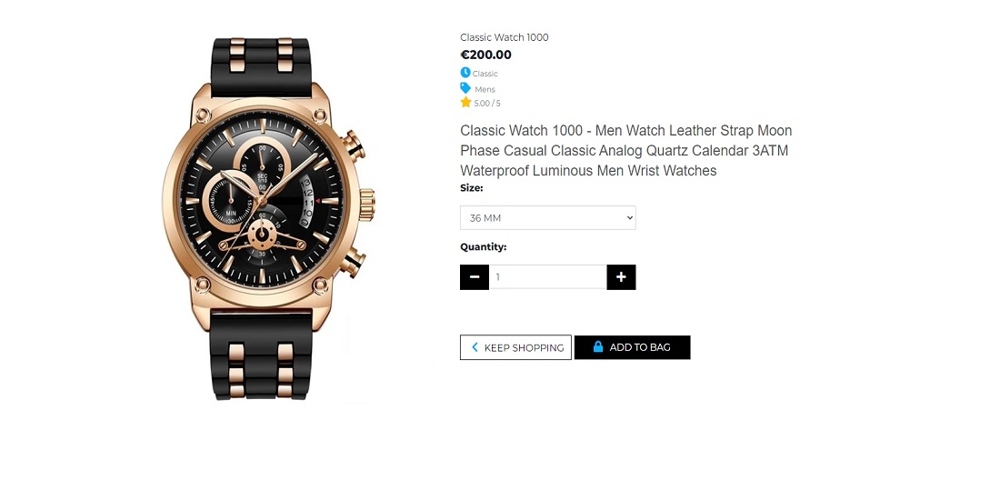

# Watches & Clocks - Introduction

Project milestone 5 for Code Institute Full-stack development program: Django Framework. 
Watches & Clocks is an E-commerce shop where users can find and buy watches and search for
products by filtering different categories. They can also register by filling in their personal
information on the website’s profile page. All the visitorsare welcome to drop a service review
and help the site admin to improve the service. The application has agood appearance with an easy,
clear and concise site navigation.

[Live Project Here](https://watches-and-clocks-portfolio-5.herokuapp.com/)

README Table Content

- [Watches \& Clocks - Introduction](#watches--clocks---introduction)
  - [User Experience - UX](#user-experience---ux)
    - [User Stories](#user-stories)
    - [Agile Methodology](#agile-methodology)
    - [The Scope](#the-scope)
      - [Main Site Goals](#main-site-goals)
  - [Design](#design)
      - [Colours](#colours)
      - [Typography](#typography)
      - [Imagery](#imagery)
      - [Video](#video)
    - [Wireframes](#wireframes)
  - [Database Diagram](#database-diagram)
  - [Features](#features)
    - [Landing Page](#landing-page)
    - [Home Page - Images Carousel](#home-page---images-carousel)
    - [Home Page - Selected Products](#home-page---selected-products)
    - [Home Page - Image Banner](#home-page---image-banner)
    - [Home Page - Customers Reviews Carousel](#home-page---customers-reviews-carousel)
    - [Products Page](#products-page)
    - [Products Details](#products-details)
    - [Products Details - Features](#products-details---features)
    - [Products Details - Products on Sale](#products-details---products-on-sale)
    - [Products Shopping Bag](#products-shopping-bag)
    - [Products Shopping Bag - Products Coming Soon](#products-shopping-bag---products-coming-soon)
    - [Products Checkout](#products-checkout)
    - [Products Checkout - Success](#products-checkout---success)
    - [Products Management](#products-management)
    - [Profile Page](#profile-page)
      - [Service Reviews Page](#service-reviews-page)
      - [Add/Edit Service Review Page](#addedit-service-review-page)
    - [Signup Page](#signup-page)
    - [Signup Page - Verify Email](#signup-page---verify-email)
    - [Signup Page - Confirm Email](#signup-page---confirm-email)
    - [Login Page](#login-page)
    - [Logout Page](#logout-page)
    - [Reset Password Page](#reset-password-page)
    - [Change Password Page](#change-password-page)
    - [Navbar](#navbar)
    - [Footer](#footer)

## User Experience - UX

### User Stories

- As a website user, I can:

1. Navigate around the site and easily view the desired content.
2. View a list of products and choose accordingly.
3. Search products to find a specific product.
4. Click on a product to read and view the details.
5. Register for an account to avail of the services offered to members.
6. View product comments so that I can read other users opinions.
7. Buy a product by using the website checkout system.

- As a logged in website user, I can:

1. Review the website service.
2. Delete my previous reviews.
3. Save my data under my personal profile.
4. Edit my previous reviews.
5. Manage my profile by updating my details.
6. Logout of the website.
7. Using my personal profile, buy a product by using the website checkout system.

- As a website Superuser, I can:

1. Create and publish a new product.
2. Create a draft of a a new product so it can be finalised later.
3. Create a new user, products, and categories.
4. Delete user, products, categories and reviews.
5. Approve user's reviews.
6. Change a user’s permissions on the website
7. Upload new banners to be displayed on the website.

### Agile Methodology

All functionality and development of this project were managed using GitHub which Projects can be found
[here](https://github.com/PedroCristo/portfolio_project_5/issues)

### The Scope

#### Main Site Goals

- To provide users with a good website experience with watches and clocks on display.
- To provide users with a visually pleasing website that is intuitive and easy to navigate.
- To provide a website with a clear purpose.
- To provide tools that allow users to search for products.
- To provide users with an easy and safe way to buy their products.

## Design

#### Colours

 

- The colour scheme is kept simple by opting for a combination of white text set against the image
  background and black text set against the white background. The navbar was set on a white background
  and a light grey on the bottom. The interactive colour is used for icons and the website logo.
  Yellow is used for the "Buy Now" buttons and red is used to the "Discover More" buttons. The Dark grey was used for the
  website footer. This contrasts with the rest of the website.

#### Typography

- The Montserrat font is used as the main font for the whole project. The Kaushan font is used to
  display the website logo.

#### Imagery

- All the images were converted to webp format to improve the website performance. The product images and banners are
  uploaded by the admin panel. The image banners are available in two different sizes. The different sizes allow for the
  banners to be displayed on both desktop and mobile platforms.

#### Video

- On the landing page, 2 videos playing as a background. One video is displayed on the desktop platform whilst
  the second video plays on the mobile platform. The two videos were both compressed to improve the website's performance.

### Wireframes

Wireframes for this project are located [here](WIREFRAMES.md)

## Database Diagram

 

## Features

### Landing Page

- The Landing page works as the website cover. Users will see a background video playing in a loop, a slogan text about
  the available collection, and two social media buttons. There is also a button to go to the website's Home Page. 

### Home Page - Images Carousel

- The home page is equipped with a 3 images carousel on the
  top. Users will see 3 Watches & Clocks shop banners advertising products and services. 

### Home Page - Selected Products

- In this feature, users will see a variety of products selected by the website admin. It can be used to highlight special
  or popular products. The website admin can choose the displayed products by selecting a product in
  the admin panel or from the website front-end by clicking on the featured box. 

### Home Page - Image Banner

- This banner feature is used to advertise new or popular products on the website. The website admin can upload many
  of images through the admin panel and choose the one to be displayed by clicking on the banner featured box. It allows
  the admin to change the banner easily depending on what will be better to be displayed at a certain moment. 

### Home Page - Customers Reviews Carousel

- In this feature, users can see a list of website service reviews written by other users.
  The website admin can choose which reviews are displayed on this carousel by clicking the
  Carousel Review box in the admin panel. 

### Products Page

- On this page, users will see all the products available on thewebsite such as product details. For example,
  if the user is interested in the watch they can press the button "Buy Now". They can also sort products by price,
  name, rating and category. Furthermore, when the site admin is logged in, it can edit or delete products. 

### Products Details

- This feature is at the top of the Product Details Page. Here users can see the product image and product
  information such as price, category, gendercategory and rating. If the user is interested in the watch they can 
  choose the product size, product quantity and add the product to their shopping bag. Also, the user can leave the 
  page by pressing the button "Keep Shopping".

### Products Details - Features

- Scrolling down, the user will have access to the full product details such as watch features and watch details. 

### Products Details - Products on Sale

- In this feature users, can see a selection of products on sale. The sale items are chosen by the website admin by adding an old price and
changing the product status to sale. This is completed through the admin panel or from the website front-end. 

### Products Shopping Bag

- TThis feature is called the Shopping bag. Here, users can add products and quantities. Check the total price, and delivery costs and go 
to the secure checkout to finish the order. Before secure checkout. the user can also change the quantity and remove unwanted products. The
user can also leave this page by pressing the button "Keep Shopping". 

### Products Shopping Bag - Products Coming Soon

- Scrolling down users can see a carousel displaying a selection of Coming Soon products that will be available for future
purchase. The website admin can add products to this list by clicking the Coming Soon box in the admin panel or from the website front-end. 

### Products Checkout

- On the checkout page, users will have to fill out the form and add the credit/debit card details to finish the purchase. 

### Products Checkout - Success

- On the checkout page, users will have to fill out the form and add their credit/debit card details to finish the purchase. 

### Products Management

- When the website admin is logged in on this page, they can add a new product to the website without going to the admin panel. 

### Profile Page

- On this page a logged in user (with a valid registration account) can add or edit their own personal details and also check previous orders. 

#### Service Reviews Page

- On this feature, users can see website service reviews written by other users or their own reviews if they have submitted a review before. 

#### Add/Edit Service Review Page

- On this page a user with a valid registration account and logged in can add or edit their own personal service reviews. 

### Signup Page

- After submitting the Signup form, the user will be redirected to this page, advising them to check the link sent to their email box. 

### Signup Page - Verify Email

- TAfter submitting the Signup form, the user will be redirected to this page, advising them to check the link sent to their email box. 

### Signup Page - Confirm Email

- Once the user clicks on the link sent to their email box, it will redirect the user to this page which confirms their email. 

### Login Page

- On the Login Page, users can log in to the website by inputting their username and password. The user is now
registered and will have access to the Registered User website services. 

### Logout Page

- On the Logout Page, users can confirm that they wish to exit the website. 

### Reset Password Page

- Users can use this page to reset their login password. The user adds their email address in the input field and clicks on the button "Reset Password". 

### Change Password Page

- Users will get a link to reset their password and after clicking on the link it will redirect the user to this page where they can set a new password. 

### Navbar

- The navigation bar is present at the top of every page and houses all links to the various other pages.
- The links at the bottom of the navbar are dropdown menus. They are used to filter products such as all products, types of watches, gender and special offers.
- Is available also a link to go to the Home Page and another one for more options.
- A link is also available to go to the Home Page and another link is available for More Options.
- When a user has logged in, their option to Register or Log in will change to the log out option.
- When a user has signed in, more options such as profile or add review will be available in the navbar.
- Also, a search box is nested in the navbar.
- The navbar is fully responsive. It collapses into a hamburger menu when the screen size decreases. 

### Footer

- On the website footer, users can see basic information about the Watches & Clocks. The information includes contact, social media,
  copyright, and a form where they can subscribe to the newsletter. 

