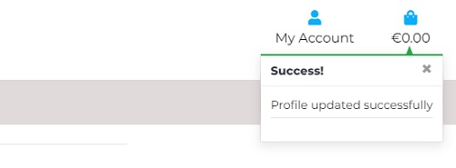
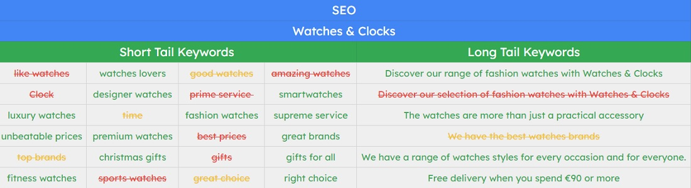

# Watches & Clocks - Introduction

Project milestone 5 for Code Institute Full-stack development program: Django Framework.<br>
Watches & Clocks is an E-commerce shop where users can find and buy watches and search for
products by filtering different categories. They can also register by filling in their personal
information on the website’s profile page. All the visitorsare welcome to drop a service review
and help the site admin to improve the service. The application has agood appearance with an easy,
clear and concise site navigation.

[Live Project Here](https://watches-and-clocks-portfolio-5.herokuapp.com/)

<p align="center"></p>

README Table Content

- [Watches \& Clocks - Introduction](#watches--clocks---introduction)
  - [User Experience - UX](#user-experience---ux)
    - [User Stories](#user-stories)
    - [Agile Methodology](#agile-methodology)
    - [The Scope](#the-scope)
      - [Main Site Goals](#main-site-goals)
  - [Design](#design)
      - [Colours](#colours)
      - [Typography](#typography)
      - [Imagery](#imagery)
      - [Video](#video)
    - [Wireframes](#wireframes)
  - [Database Diagram](#database-diagram)
  - [Features](#features)
    - [Landing Page](#landing-page)
    - [Home Page - Images Carousel](#home-page---images-carousel)
    - [Home Page - Selected Products](#home-page---selected-products)
    - [Home Page - Image Banner](#home-page---image-banner)
    - [Home Page - Customers Reviews Carousel](#home-page---customers-reviews-carousel)
    - [Products Page](#products-page)
    - [Products Details](#products-details)
    - [Products Details - Features](#products-details---features)
    - [Products Details - Products on Sale](#products-details---products-on-sale)
    - [Products Shopping Bag](#products-shopping-bag)
    - [Products Shopping Bag - Products Coming Soon](#products-shopping-bag---products-coming-soon)
    - [Products Checkout](#products-checkout)
    - [Products Checkout - Success](#products-checkout---success)
    - [Products Management](#products-management)
    - [Profile Page](#profile-page)
      - [Service Reviews Page](#service-reviews-page)
      - [Add/Edit Service Review Page](#addedit-service-review-page)
    - [Signup Page](#signup-page)
    - [Signup Page - Verify Email](#signup-page---verify-email)
    - [Signup Page - Confirm Email](#signup-page---confirm-email)
    - [Login Page](#login-page)
    - [Logout Page](#logout-page)
    - [Reset Password Page](#reset-password-page)
    - [Change Password Page](#change-password-page)
    - [Navbar](#navbar)
    - [Footer](#footer)
    - [Page 404 - Page Not Found](#page-404---page-not-found)
  - [Messages and Interaction with Users](#messages-and-interaction-with-users)
    - [Sign up 1](#sign-up-1)
    - [Sign up 2](#sign-up-2)
    - [Login](#login)
    - [Logout](#logout)
    - [Profile Update](#profile-update)
    - [Service Review - Add Review](#service-review---add-review)
    - [Service Review - Update Review 1](#service-review---update-review-1)
    - [Service Review - Update Review 2](#service-review---update-review-2)
    - [Service Review - Delete Review 1](#service-review---delete-review-1)
    - [Service Review - Delete Review 2](#service-review---delete-review-2)
    - [Service Review - Delete Review 3](#service-review---delete-review-3)
    - [Add Product](#add-product)
    - [Edit Product 1](#edit-product-1)
    - [Edit Product 2](#edit-product-2)
    - [Edit Product 3](#edit-product-3)
    - [Delete Product 1](#delete-product-1)
    - [Delete Product 2](#delete-product-2)
    - [Delete Product 3](#delete-product-3)
    - [Add Product to Bag](#add-product-to-bag)
    - [Update Bag](#update-bag)
    - [Remove Product from Bag](#remove-product-from-bag)
    - [Purchase Success](#purchase-success)
    - [Purchase Success - Confirmation Email](#purchase-success---confirmation-email)
  - [Admin Panel / Superuser](#admin-panel--superuser)
  - [Marketing and Social Media](#marketing-and-social-media)
    - [Statista - Facebook Users](#statista---facebook-users)
    - [Watches \& Clocks - Facebook Page](#watches--clocks---facebook-page)
    - [Meta Pixel - Tracking Audience](#meta-pixel---tracking-audience)
    - [Mailchimp Subscription Service](#mailchimp-subscription-service)
  - [Privacy Policy](#privacy-policy)
  - [Search Engine Optimization](#search-engine-optimization)
    - [sitemap.xml](#sitemapxml)
    - [robots.txt](#robotstxt)
    - [Sitemap Google Registration](#sitemap-google-registration)
  - [AWS Setup Process](#aws-setup-process)
    - [AWS S3 Bucket](#aws-s3-bucket)
    - [IAM Set Up](#iam-set-up)
    - [Connecting AWS to the Project](#connecting-aws-to-the-project)
  - [Stripe Payments](#stripe-payments)
    - [Payments](#payments)
    - [Webhooks](#webhooks)
  - [Technologies Used](#technologies-used)
    - [Languages Used](#languages-used)
    - [Django Packages](#django-packages)
    - [Frameworks - Libraries - Programs Used](#frameworks---libraries---programs-used)
    - [Testing](#testing)
  - [Creating the Django app](#creating-the-django-app)
  - [Deployment of This Project](#deployment-of-this-project)
  - [Final Deployment](#final-deployment)
  - [Forking This Project](#forking-this-project)
  - [Cloning This Project](#cloning-this-project)
  - [Credits](#credits)
    - [Content](#content)
    - [Information Sources / Resources](#information-sources--resources)
  - [Special Thanks](#special-thanks)

## User Experience - UX

### User Stories

- As a website user, I can:

1. Navigate around the site and easily view the desired content.
2. View a list of products and choose accordingly.
3. Search products to find a specific product.
4. Click on a product to read and view the details.
5. Register for an account to avail of the services offered to members.
6. View product comments so that I can read other users opinions.
7. Buy a product by using the website checkout system.

- As a logged in website user, I can:

1. Review the website service.
2. Delete my previous reviews.
3. Save my data under my personal profile.
4. Edit my previous reviews.
5. Manage my profile by updating my details.
6. Logout of the website.
7. Using my personal profile, buy a product by using the website checkout system.

- As a website Superuser, I can:

1. Create and publish a new product.
2. Create a draft of a a new product so it can be finalised later.
3. Create a new user, products, and categories.
4. Delete user, products, categories and reviews.
5. Approve user's reviews.
6. Change a user’s permissions on the website
7. Upload new banners to be displayed on the website.

### Agile Methodology

All functionality and development of this project were managed using GitHub which Projects can be found
[here](https://github.com/PedroCristo/portfolio_project_5/issues)

### The Scope

#### Main Site Goals

- To provide users with a good website experience with watches and clocks on display.
- To provide users with a visually pleasing website that is intuitive and easy to navigate.
- To provide a website with a clear purpose.
- To provide tools that allow users to search for products.
- To provide users with an easy and safe way to buy their products.

## Design

#### Colours

<br>

- The colour scheme is kept simple by opting for a combination of white text set against the image
  background and black text set against the white background. The navbar was set on a white background
  and a light grey on the bottom. The interactive colour is used for icons and the website logo.
  Yellow is used for the "Buy Now" buttons and red is used to the "Discover More" buttons. The Dark grey was used for the
  website footer. This contrasts with the rest of the website.

#### Typography

- The Montserrat font is used as the main font for the whole project. The Kaushan font is used to
  display the website logo.

#### Imagery

- All the images were converted to webp format to improve the website performance. The product images and banners are
  uploaded by the admin panel. The image banners are available in two different sizes. The different sizes allow for the
  banners to be displayed on both desktop and mobile platforms.

#### Video

- On the landing page, 2 videos playing as a background. One video is displayed on the desktop platform whilst
  the second video plays on the mobile platform. The two videos were both compressed to improve the website's performance.

### Wireframes

Wireframes for this project are located [here](WIREFRAMES.md)

## Database Diagram

<br>

## Features

### Landing Page


- The Landing page works as the website cover. Users will see a background video playing in a loop, a slogan text about
  the available collection, and two social media buttons. There is also a button to go to the website's Home Page.<br>

### Home Page - Images Carousel


- The home page is equipped with a 3 images carousel on the
  top. Users will see 3 Watches & Clocks shop banners advertising products and services.<br>

### Home Page - Selected Products


- In this feature, users will see a variety of products selected by the website admin. It can be used to highlight special
  or popular products. The website admin can choose the displayed products by selecting a product in
  the admin panel or from the website front-end by clicking on the featured box.<br>

### Home Page - Image Banner


- This banner feature is used to advertise new or popular products on the website. The website admin can upload many
  of images through the admin panel and choose the one to be displayed by clicking on the banner featured box. It allows
  the admin to change the banner easily depending on what will be better to be displayed at a certain moment.<br>

### Home Page - Customers Reviews Carousel


- In this feature, users can see a list of website service reviews written by other users.
  The website admin can choose which reviews are displayed on this carousel by clicking the
  Carousel Review box in the admin panel.<br>

### Products Page


- On this page, users will see all the products available on thewebsite such as product details. For example,
  if the user is interested in the watch they can press the button "Buy Now". They can also sort products by price,
  name, rating and category. Furthermore, when the site admin is logged in, it can edit or delete products.<br>

### Products Details


- This feature is at the top of the Product Details Page. Here users can see the product image and product
  information such as price, category, gendercategory and rating. If the user is interested in the watch they can 
  choose the product size, product quantity and add the product to their shopping bag. Also, the user can leave the 
  page by pressing the button "Keep Shopping".

### Products Details - Features


- Scrolling down, the user will have access to the full product details such as watch features and watch details.<br>

### Products Details - Products on Sale


- In this feature users, can see a selection of products on sale. The sale items are chosen by the website admin by adding an old price and
changing the product status to sale. This is completed through the admin panel or from the website front-end.<br>

### Products Shopping Bag


- TThis feature is called the Shopping bag. Here, users can add products and quantities. Check the total price, and delivery costs and go 
to the secure checkout to finish the order. Before secure checkout. the user can also change the quantity and remove unwanted products. The
user can also leave this page by pressing the button "Keep Shopping".<br>

### Products Shopping Bag - Products Coming Soon


- Scrolling down users can see a carousel displaying a selection of Coming Soon products that will be available for future
purchase. The website admin can add products to this list by clicking the Coming Soon box in the admin panel or from the website front-end.<br>

### Products Checkout


- On the checkout page, users will have to fill out the form and add the credit/debit card details to finish the purchase.<br>

### Products Checkout - Success


- On the checkout page, users will have to fill out the form and add their credit/debit card details to finish the purchase.<br>

### Products Management


- When the website admin is logged in on this page, they can add a new product to the website without going to the admin panel.<br>

### Profile Page


- On this page a logged in user (with a valid registration account) can add or edit their own personal details and also check previous orders.<br>

#### Service Reviews Page


- On this feature, users can see website service reviews written by other users or their own reviews if they have submitted a review before.<br>

#### Add/Edit Service Review Page


- On this page a user with a valid registration account and logged in can add or edit their own personal service reviews.<br>

### Signup Page


- After submitting the Signup form, the user will be redirected to this page, advising them to check the link sent to their email box.<br>

### Signup Page - Verify Email


- TAfter submitting the Signup form, the user will be redirected to this page, advising them to check the link sent to their email box.<br>

### Signup Page - Confirm Email


- Once the user clicks on the link sent to their email box, it will redirect the user to this page which confirms their email.<br>

### Login Page


- On the Login Page, users can log in to the website by inputting their username and password. The user is now
registered and will have access to the Registered User website services.<br>

### Logout Page


- On the Logout Page, users can confirm that they wish to exit the website.<br>

### Reset Password Page


- Users can use this page to reset their login password. The user adds their email address in the input field and clicks on the button "Reset Password".<br>

### Change Password Page


- Users will get a link to reset their password and after clicking on the link it will redirect the user to this page where they can set a new password.<br>

### Navbar


- The navigation bar is present at the top of every page and houses all links to the various other pages.
- The links at the bottom of the navbar are dropdown menus. They are used to filter products such as all products, types of watches, gender and special offers.
- Is available also a link to go to the Home Page and another one for more options.
- A link is also available to go to the Home Page and another link is available for More Options.
- When a user has logged in, their option to Register or Log in will change to the log out option.
- When a user has signed in, more options such as profile or add review will be available in the navbar.
- Also, a search box is nested in the navbar.
- The navbar is fully responsive. It collapses into a hamburger menu when the screen size decreases.<br>

### Footer


- On the website footer, users can see basic information about the Watches & Clocks. The information includes contact, social media,
  copyright, and a form where they can subscribe to the newsletter.<br>

### Page 404 - Page Not Found


- The user will see this feature when the page that the user is looking for, does not exist or for any typing URL error.<br>  

## Messages and Interaction with Users

- Some interactive messages were added to the project to make the navigation on the website easier and to improve the
  user's experience.

### Sign up 1


- When users sign up to the website they will see a message at the top right of the page saying "Confirmation sent to the sign up email address"<br>

### Sign up 2


- The user confirms their sign up email address. Once confirmed, the user will see the following message "You have
confirmed (email used to sign up) at the top right of the page Login.<br>

### Login


- WWhen users sign in to the website they will see a message "Successfully signed in as (username)" at the top right of the page.<br>

### Logout


- When users log out of the website they will see the message "You have signed out" at the top right of the page.<br>

### Profile Update



- When users update their profile they will see a message that their account has been updated at the top right of the page.<br>

### Service Review - Add Review


- WWhen users are logged in to the website they can add a service review. When they submit the review they
will see a message "Your review was sent successfully and is awaiting approval" at the top right of the page.<br>

### Service Review - Update Review 1


- When users are logged in to the website and have previously posted a review they will see the "Edit"
  button at the bottom of their reviews <br>

### Service Review - Update Review 2


- After the review is updated the user will see the message "The review was successfully updated" at the top right of the screen.<br>

### Service Review - Delete Review 1


- When users are logged in to the website and have previously posted a review they will see the "Delete"
  button at the bottom of their reviews.<br>

### Service Review - Delete Review 2


- If the user wishes to delete their review, they can press the "Delete" button and a Bootstrap box model will pop up with the message "Are you sure you want to delete your review?".<br>

### Service Review - Delete Review 3


- When the user presses the "Delete" button again within the Bootstrap box model they will see the message "The review was deleted successfully"
at the top right of the page.<br>

### Add Product


- When the website admin is logged in, they can add new products through the website front-end. When submitted successfully 
the following message "Successfully added product" pops up at the top right of the page.<br>

### Edit Product 1


- When the website admin is logged in, they can edit products already added through the website&#39;s front-end by clicking on the "Edit" button.<br>

### Edit Product 2


- Once the button is clicked the website admin will see the following alert "You are editing (product name)" at the top right of the screen.<br>

### Edit Product 3


- After the "Update Product" button is pressed and the product is edited successfully, the website admin will see the message
"Successfully updated product!" at the top right of the page.<br>

### Delete Product 1


- When the website admin is logged in, they can delete products already added through the website’s front-end by clicking the "Delete" button.<br>

### Delete Product 2


- After pressing the "Delete" button the Bootstrap box model will pop up with a message "Are you sure you want to delete this
product?"at the in the centre of the page.<br>

### Delete Product 3


- When the user presses the "Delete" button again within the Bootstrap box model they will see the message "Product
deleted" at the top right of the page.<br>

### Add Product to Bag


- When users choose a product and add it to the bag they will see a success message at the top right of the screen.<br>

### Update Bag


- When users update the bag they will see a success message at the top right of the screen.<br>

### Remove Product from Bag


- When users remove the products from the bag they will see a success message at the top right of the screen.<br>

### Purchase Success


- When users fill out the check-out form and complete the purchase they will see a success message
  with the order details at the top right of the screen.<br>

### Purchase Success - Confirmation Email


- When users successfully purchase a product they are sent an automatic confirmation email containing all of their order details.<br>

## Admin Panel / Superuser


- On the Admin Panel and as an admin/superuser I have full access to CRUD functionality. This means I can view, create, edit and
  delete the following apps:

1. Banners
2. Checkout
3. Products
4. Profiles
5. Reviews

- As admin/superuser I can also approve reviews, change the status and give other permissions.<br>

## Marketing and Social Media

- Market research was undertaken to decide on the appropriate marketing strategy to promote the Watches & Clocks brand. For social media marketing,
Facebook is still the best option to promote brands to potential customers. It is one of the most used social media platforms with 22% of users
aged between 18 - 24 and 31% of users aged between 25 - 34. This age category is the main target audience for Watches & Clocks. 
This age range is viewed as the most likely to become potential customers.<br>

### Statista - Facebook Users


- Distribution of Facebook users worldwide as of 2022 according to [Statista](https://www.statista.com/)<br>

### Watches & Clocks - Facebook Page


- [Watches & Clocks Facebook Page](https://www.facebook.com/people/Watches-Clocks/100086385370740/)<br>

### Meta Pixel - Tracking Audience

- In order to improve the website services, I have set a Meta Pixel service to track the Watches & Clocks audience.

<br>

### Mailchimp Subscription Service

- Users are encouraged to signup for newsletters, discounts and information about the products sold at Watches & Clocks.
  The signup form is available on the website footer and is present on any page. The email subscription service is run through
  Mailchimp, allowing the website admin to send marketing emails through the platform, increasing engagement within the site. Below
  is a screenshot of the Watches & Clocks - Mailchimp dashboard.

<br>

## Privacy Policy

- In order to add a page with the Watches & Clocks Privacy Policy I used the service [Privacy Policy Generator](https://www.privacypolicygenerator.info/) to ensure 
that the website is compliant with the European Privacy Policy Rules.<br>


- [Watches & Clocks - Privacy Policy Page](https://www.privacypolicygenerator.info/live.php?token=He4U9OHbOs5hfHSPBg0sqUnVRq04P12y)<br>

## Search Engine Optimization

- The site was optimized by careful selection of keywords relating to the "world" of watches and shops. The entire table has important 
relevant topics relating to watches and shops. The chosen topics/words are based on my initial understanding of the business. Keywords were chosen 
based on common topics and themes within the watch and clocks’ industry. Topics and keywords were then tested tried out on Google and the relevant
returned search suggestions it gave were added to the keyword list. The words crossed out in red wereremoved. Wordtracker highlighted these key 
words as too popular. Words crossed out in yellow were removed as they were not relevant or specific to the site.<br>

<br>

### sitemap.xml

- A sitemap file with a list of important URLs was added to ensure that search engines are able to easily navigate through the site
  and understand its structure. This was made using XML-sitemaps.com by following the steps:

1. Paste the URL of the deployed site into XML-sitemaps
2. Download the XML sitemap file
3. Add the file into the projects root folder, named as sitemap.xml<br>

### robots.txt

- A robots.txt file was created to tell search engines where not to go on the website and increase the quality of the site, ultimately improving the SEO rating.

<br>

### Sitemap Google Registration

- To ensure that the Google engine will check the website sitemap file I have registered the Watches & Clocks URL on the Google Search Console.

<br>

## AWS Setup Process

### AWS S3 Bucket 

The deployed site uses AWS S3 Buckets to store the webpages static and media files. More information on how you can set up an AWS S3 Bucket can be found below:

1. Create an AWS account [here](https://portal.aws.amazon.com/).
2. Login to your account and within the search bar type in "S3".
3. Within the S3 page click on the button that says "Create Bucket".
4. Name the bucket and select the region which is closest to you.
5. Underneath "Object Ownership" select "ACLs enabled".
6. Uncheck "Block Public Access" and acknowledge that the bucket will be made public, then click "Create Bucket".
7. Inside the created bucket click on the "Properties" tab. Below "Static Website Hosting" click "Edit" and change the Static website hosting option to "Enabled". Copy the default values for the index and error documents and click "Save Changes".
8. Click on the "Permissions" tab, below "Cross-origin Resource Sharing (CORS)", click "Edit" and then paste in the following code:

  ```
    [
        {
            "AllowedHeaders": [
            "Authorization"
            ],
            "AllowedMethods": [
            "GET"
            ],
            "AllowedOrigins": [
            "*"
            ],
            "ExposeHeaders": []
        }
    ]
  ```

9. Within the "Bucket Policy" section. Click "Edit" and then "Policy Generator". Click the "Select Type of Policy" dropdown and select "S3 Bucket Policy" and within "Principle" allow all principals by typing "*".
10. Within the "Actions" dropdown menu select "Get Object" and in the previous tab copy the "Bucket ARN number". Paste this within the policy generator within the field labelled "Amazon Resource Name (ARN)".
11. Click "Add statement > Generate Policy" and copy the policy that's been generated and paste this into the "Bucket Policy Editor".
12. Before saving, add /* at the end of your "Resource Key", this will allow access to all resources within the bucket.
13. Once saved, scroll down to the "Access Control List (ACL)" and click "Edit".
14. Next to "Everyone (public access)", check the "list" checkbox and save your changes.

### IAM Set Up

1. Search for IAM within the AWS navigation bar and select it.
2. Click "User Groups" that can be seen in the side bar and then click "Create group" and name the group 'manage-your-project-name'.
3. Click "Policies" and then "Create policy".
4. Navigate to the JSON tab and click "Import Managed Policy", within here search "S3" and select "AmazonS3FullAccess" followed by "Import".
5. Navigate back to the recently created S3 bucket and copy your "ARN Number". Go back to "This Policy" and update the "Resource Key" to include your ARN Number, and another line with your ARN followed by a "/*".
   
- Below is an example of what this should look like:

```
{
    "Version": "2012-10-17",
    "Statement": [
        {
            "Effect": "Allow",
            "Action": [
                "s3:*",
                "s3-object-lambda:*"
            ],
            "Resource": [
                "YOUR-ARN-NO-HERE",
                "YOUR-ARN-NO-HERE/*"
            ]
        }
    ]
}

```

1. Ensure the policy has been given a name and a short description, then click "Create Policy".
2. Click "User groups", and then the group you created earlier. Under permissions click "Add Permission" and from the dropdown click "Attach Policies".
3. Select "Users" from the sidebar and click "Add User".
4. Provide a username and check "Programmatic Access", then click 'Next: Permissions'.
5. Ensure your policy is selected and navigate through until you click "Add User".
6. Download the "CSV file", which contains the user's access key and secret access key.

### Connecting AWS to the Project

1. Within your terminal install the following packages by typing 

```
  pip3 install boto3
  pip3 install django-storages 
```  

2. Freeze the requirements by typing:

```
pip3 freeze > requirements.txt
```

3. Add "storages" to your installed apps within your settings.py file.
4. At the bottom of the settings.py file add the following code:

```
if 'USE_AWS' in os.environ:
    AWS_STORAGE_BUCKET_NAME = 'insert-bucket-name-here'
    AWS_S3_REGION_NAME = 'insert-your-region-here'
    AWS_ACCESS_KEY_ID = os.environ.get('AWS_ACCESS_KEY_ID')
    AWS_SECRET_ACCESS_KEY = os.environ.get('AWS_SECRET_ACCESS_KEY')
```
5. Add the following keys within Heroku: "AWS_ACCESS_KEY_ID" and "AWS_SECRET_ACCESS_KEY". These can be found in your CSV file.
6. Add the key "USE_AWS", and set the value to True within Heroku.
6. Remove the "DISABLE_COLLECTSTAIC" variable from Heroku.
7. Within your settings.py file inside the code just written add: 

```
  AWS_S3_CUSTOM_DOMAIN = f"{AWS_STORAGE_BUCKET_NAME}.s3.amazonaws.com"
```
8. Inside the settings.py file inside the bucket config if statement add the following lines of code:

```
STATICFILES_STORAGE = 'custom_storages.StaticStorage'
STATICFILES_LOCATION = 'static'
DEFAULT_FILE_STORAGE = 'custom_storages.MediaStorage'
MEDIAFILES_LOCATION = 'media'

STATIC_URL = f'https://{AWS_S3_CUSTOM_DOMAIN}/{STATICFILES_LOCATION}/'
MEDIA_URL = f'https://{AWS_S3_CUSTOM_DOMAIN}/{MEDIAFILES_LOCATION}/'

AWS_S3_OBJECT_PARAMETERS = {
    'Expires': 'Thu, 31 Dec 2099 20:00:00 GMT',
    'CacheControl': 'max-age=94608000',
}
```

9. In the root directory of your project create a file called "custom_storages.py". Import the following at the top of this file and add the classes below:

```
  from django.conf import settings
  from storages.backends.s3boto3 import S3Boto3Storage

  class StaticStorage(S3Boto3Storage):
    location = settings.STATICFILES_LOCATION

  class MediaStorage(S3Boto3Storage):
    location = settings.MEDIAFILES_LOCATION
```

10. Navigate back to you AWS S3 Bucket and click on "Create Folder" name this folder "media", within the media file click "Upload > Add Files" and select the images for your site.
11. Under "Permissions" select the option "Grant public-read access" and click "Upload".

## Stripe Payments

- The Stripe payments system is set up as the online payment processing and credit card processing platform for the purchases. 
You will need a stripe account which you can sign up for [here](https://stripe.com/en-ie)

### Payments 
- To set up stripe payments you can follow their guid [here](https://stripe.com/docs/payments/accept-a-payment#web-collect-card-details)

### Webhooks

1. To set up a webhook, sign into your stripe account and click 'Developers' located in the top right of the navbar.
2. Then in the side-nav under the Developers title, click on "Webhooks", then "Add endpoint".
3. On the next page you will need to input the link to your heroku app followed by /checkout/wh/. It should look something like this:
   
    ```
    https://your-app-name.herokuapp.com/checkout/wh/
    ```

4. Then click "+ Select events" and check the "Select all events" checkbox at the top before clicking "Add events" at the bottom. Once this is done finish the form by clicking "Add endpoint".
5. Your webhook is now created and you should see that it has generated a secret key. You will need this to add to your heroku config vars.
6. Head over to your app in heroku and navigate to the config vars section under settings. You will need the secret key you just generated for your webhook, in addition to your Publishable key and secret key that you can find in the API keys section back in stripe.
7. Add these values under these keys:
   
    ```
    STRIPE_PUBLIC_KEY = 'insert your stripe publishable key'
    STRIPE_SECRET_KEY = 'insert your secret key'
    STRIPE_WH_SECRET = 'insert your webhooks secret key'

    ```
8. Finally, back in your settings.py file in django, insert the following near the bottom of the file:  
    ```
    STRIPE_PUBLIC_KEY = os.getenv('STRIPE_PUBLIC_KEY', '')
    STRIPE_SECRET_KEY = os.getenv('STRIPE_SECRET_KEY', '')
    STRIPE_WH_SECRET = os.getenv('STRIPE_WH_SECRET', '')
    ```
- Below is a screenshot of the Watches & Clocks - Stripe dashboard.

<br>

## Technologies Used

### Languages Used

- [HTML 5](https://en.wikipedia.org/wiki/HTML/)
- [CSS 3](https://en.wikipedia.org/wiki/CSS)
- [JavaScript](https://www.javascript.com/)
- [Django](https://www.python.org/)
- [Python](https://www.djangoproject.com/)<br>

### Django Packages

- [Gunicorn](https://gunicorn.org/) as the server for Heroku
- [Dj_database_url](https://pypi.org/project/dj-database-url/) to parse the database URL from the environment variables in Heroku
- [Psycopg2](https://pypi.org/project/psycopg2/) as an adaptor for Python and PostgreSQL databases
- [Summernote](https://summernote.org/) as a text editor
- [Allauth](https://django-allauth.readthedocs.io/en/latest/installation.html) for authentication, registration and account management
- [Stripe](https://pypi.org/project/stripe/) for processing all online and credit card purchases on the website
- [Crispy Forms](https://django-crispy-forms.readthedocs.io/en/latest/) to style the forms
- [Pillow](https://pypi.org/project/Pillow/) to process and save all the images downloaded through the database<br>

### Frameworks - Libraries - Programs Used

- [Bootstrap](https://getbootstrap.com/)
- Was used to style the website, add responsiveness and interactivity
- [Jquery](https://jquery.com/)
- All the scripts were written using jquery library
- [Git](https://git-scm.com/)
- Git was used for version control by utilizing the Gitpod terminal to commit to Git and push to GitHub
- [GitHub](https://github.com/)
- GitHub is used to store the project's code after being pushed from Git
- [Heroku](https://id.heroku.com)
- Heroku was used to deploy the live project
- [PostgreSQL](https://www.postgresql.org/)
- Database used through Heroku.
- [VSCode](https://code.visualstudio.com/)
- VSCode was used to create and edit the website
- [Lucidchart](https://lucid.app/)
- Lucidchart was used to create the database diagram
- [Pycodestyle](http://pep8online.com/)
- Pycodestyle was used to validate all the Python code
- [W3C - HTML](https://validator.w3.org/)
- W3C- HTML was used to validate all the HTML code
- [W3C - CSS](https://jigsaw.w3.org/css-validator/)
- W3C - CSS was used to validate the CSS code
- [Fontawesome](https://fontawesome.com/)
- Was used to add icons to the website
- [Google Chrome Dev Tools](https://developer.chrome.com/docs/devtools/)
- To check App responsiveness and debugging
- [Google Fonts](https://fonts.google.com/)
- To add the 2 fonts that were used throughout the project
- [Balsamiq](https://balsamiq.com/)
- To build the wireframes for the project
- [PIXLR](https://pixlr.com)
- To convert the images to webp format
- [CANVA](https://www.canva.com/)
- To build the logos for the project
- [AWS](https://aws.amazon.com/)
- was used to host the static files and media<br>

### Testing

Testing results are [here](TESTING.md)

## Creating the Django app

1. Go to the Code Institute Gitpod Full Template [Template](https://github.com/Code-Institute-Org/gitpod-full-template)
2. Click on Use This Template
3. Once the template is available in your repository click on Gitpod
4. When the image for the template and the Gitpod are ready open a new terminal to start a new Django App
5. Install Django and gunicorn: pip3 install django gunicorn
6. Install supporting database libraries dj_database_url and psycopg2 library: pip3 install dj_database_url psycopg2
7. Create file for requirements: in the terminal window type pip freeze --local > requirements.txt
8. Create project: in the terminal window type django-admin startproject your_project_name
9. Create app: in the terminal window type python3 manage.py startapp your_app_name
10. Add app to the list of installed apps in settings.py file: you_app_name
11. Migrate changes: in the terminal window type python3 manage.py migrate
12. Run the server to test if the app is installed, in the terminal "The install worked successfully! Congratulations!"<br>

## Deployment of This Project

- This site was deployed by completing the following steps:

1. Log in to [Heroku](https://id.heroku.com) or create an account
2. On the main page click the button labelled New in the top right corner and from the drop-down menu select Create New
   App
3. You must enter a unique app name
4. Next select your region
5. Click on the Create App button
6. Click in resources and select Heroku Postgres database
7. Click Reveal Config Vars and add a new record with SECRET_KEY
8. Click Reveal Config Vars and add a new record with the AWS_ACCESS_KEY_ID
9. Click Reveal Config Vars and add a new record with the AWS_SECRET_ACCESS_KEY
10. Click Reveal Config Vars and add a new record with the EMAIL_HOST_PASS
11. Click Reveal Config Vars and add a new record with the EMAIL_HOST_USER
12. Click Reveal Config Vars and add a new record with the STRIPE_PUBLIC_KEY
13. Click Reveal Config Vars and add a new record with the STRIPE_SECRET_KEY
14. Click Reveal Config Vars and add a new record with the STRIPE_WH_SECRET
15. Click Reveal Config Vars and add a new record with the DISABLE_COLLECTSTATIC = 1
16. The next page is the project’s Deploy Tab. Click on the Settings Tab and scroll down to Config Vars
17. Next, scroll down to the Buildpack section click Add Buildpack select python and click Save Changes
18. Scroll to the top of the page and choose the Deploy tab
19. Select Github as the deployment method
20. Confirm you want to connect to GitHub
21. Search for the repository name and click the connect button
22. Scroll to the bottom of the deploy page and select the preferred deployment type
23. Click Enable Automatic Deploys for automatic deployment when you push updates to Github<br>

## Final Deployment

1. Create a runtime.txt "python-3.9.13"
2. Create a Procfile "web: gunicorn your_project_name.wsgi"
3. When development is complete change the debug setting to: DEBUG = False in settings.py
4. In this project the summernote editor was used so for this to work in Heroku add: X_FRAME_OPTIONS = 'SAMEORIGIN' to
   settings.py.
5. In Heroku settings config vars delete the record for DISABLE_COLLECTSTATIC
6. In Heroku settings config vars set the record for USE_AWS to True<br>

## Forking This Project

- Fork this project by following the steps:

1. Open [GitHub](https://github.com/PedroCristo/portfolio_project_5)
2. Find the "Fork" button at the top right of the page
3. Once you click the button the fork will be in your repository<br>

## Cloning This Project

- Clone this project by following the steps:

1. Open [GitHub](https://github.com/PedroCristo/portfolio_project_5)
2. You will be provided with three options to choose from, HTTPS, SSH or GitHub CLI, click the clipboard icon in order
   to copy the URL
3. Once you click the button the fork will be in your repository
4. Open a new terminal
5. Change the current working directory to the location that you want the cloned directory
6. Type "git clone" and paste the URL copied in step 3
7. Press "Enter" and the project is cloned<br>

## Credits

### Content

- All the products content were taken from [Amazon](https://www.amazon.com/)
- The images were taken from [Aliexpress](https://www.aliexpress.com/)
- The 2 videos used as a background on the Landing Page were taken from [Pexels](https://www.pexels.com/)
- The Watches & Clocks logos and favicon are my own designed and build<br>

### Information Sources / Resources

- [W3Schools - Python](https://www.w3schools.com/python/)
- [Stack Overflow](https://stackoverflow.com/)
- [Scrimba - Pyhton](https://scrimba.com/learn/python)
- [Code Institute - Slack Community](https://slack.com/)

## Special Thanks

- Special thanks to my mentor Sandeep Aggarwal, my colleagues at Code Institute, Kasia Bogucka, and Mairéad Gillic for
  their assistance throughout this project.