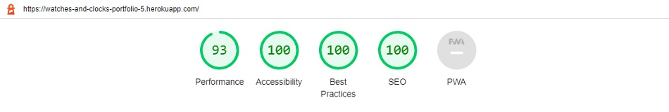
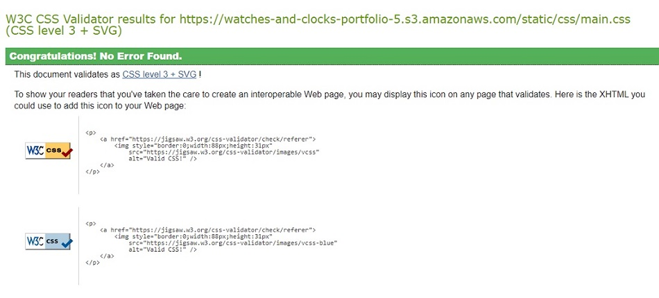
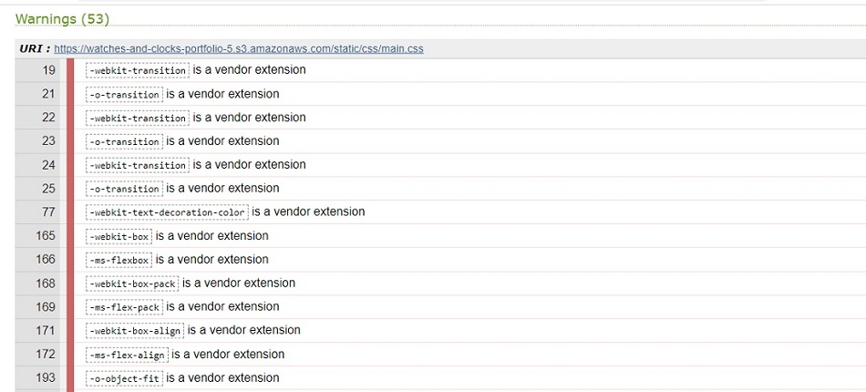

# Testing
Back to the [README](README.md)

* Testing has taken place continuously throughout the development of the project. Each view was tested regularly. 
  When the outcome was not as expected, debugging took place at that point.  

### Python Validation - Pycodestyle
* Python testing was done using the Pycodestyle to ensure there were no syntax errors in the project. All python files
were entered into the checker and no errors were found in any of the custom codes.

.

#### Checked Python Files

#### App - Bag
* apps.py
* context.py
* urls.py
* views.py
  
#### Banners - Bag
* admin.py
* apps.py
* context_processors.py
* models.py
* urls.py
* views.py
* 
#### Checkout - Bag
* admin.py
* apps.py
* forms.py
* models.py
* signals.py
* urls.py
* views.py
* webhook_handler.py
* webhooks.py
* 
#### Home - Bag
* admin.py
* apps.py
* models.py
* urls.py
* views.py

#### Products - Bag
* admin.py
* apps.py
* context_processors.py
* forms.py
* models.py
* urls.py
* views.py
* widgets.py
  
#### Profiles - Bag
* admin.py
* apps.py
* forms.py
* models.py
* urls.py
* views.py
  
#### Reviews - Bag
* admin.py
* apps.py
* context_processors.py
* forms.py
* models.py
* urls.py
* views.py
* widgets.py

#### Project - watches_and_clocks
* asgi.py
* urls.py
* wsgi.py
* settings.py
- A few errors were raised in the watches_and_clocks/settings.py file, however these were related to default django authorisation
code and could not be changed to remove the errors.
* manage.py

### Lighthouse
Lighthouse was used to test Performance, Best Practices, Accessibility and SEO on Desktop.

##### Desktop Results:
.

###### Mobile Results:
.

### CSS Validation
* Custom CSS was validated using W3C Jigsaw validation service. Fifty-three warnings were displayed, however, 
  these are related to Google Fonts and vendor extension prefixes which will not affect the CSS performance.
  
.
.